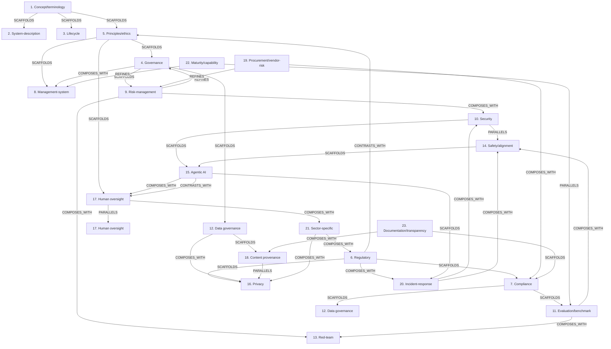

# HUMMBL Primitive Matrix v0.1 — Framework Coverage, Lifecycle, Relationships, Admission

**Status:** DRAFT_RESEARCH_ARTIFACT
**Promotion posture:** ADAPT_REQUIRED
**Canonical status:** NOT_CANON
**Origin:** Continuation of primitive expansion analysis, 2026-07-14
**Steward:** HUMMBL Research Institute
**Companion artifacts:**
- `hummbl-primitive-expansion-v0.1.md` (proposes primitives P27-P40, invariants K9-K11/D6-D7)
- `ai-framework-taxonomy-v0.1.md` (26 framework families, 498-framework inventory)
- `ai-governance-framework-inventory.md` (framework catalog)

**Validated scope:** matrices grounded in live codebase evidence (48 modules, 87 exports) and the 26-family taxonomy
**Unvalidated scope:** proposed primitive (P27-P40) coverage is projected, not measured — no implementations exist yet

---

## Verification Checklist (before promotion)

- [x] 26 framework families read from taxonomy v0.1
- [x] 40 primitives (P1-P26 existing + P27-P40 proposed) enumerated from expansion v0.1
- [x] 12 control layers (L-1 through L10) read from taxonomy v0.1
- [x] Lifecycle phases derived from `lifecycle.py` (NIST AI RMF) + universal lifecycle pattern
- [x] Framework relationship types derived from `hummbl-research` relationship graph
- [x] Admission sub-taxonomy derived from `admission_control.py` 5-gate schema + object-envelope types
- [ ] Matrix cells validated against framework coverage files (12 of 498 currently covered)
- [ ] Lifecycle coverage validated against actual framework lifecycle requirements
- [ ] Relationship graph validated against cross-framework dependencies
- [ ] Admission sub-taxonomy validated against real admission decisions

---

## Part 1: Framework-to-Primitive Matrix

### Method

Maps each of the 26 framework families (from `ai-framework-taxonomy-v0.1.md`) to the 40 primitives (P1-P26 existing + P27-P40 proposed from `hummbl-primitive-expansion-v0.1.md`).

Coverage notation:
- **●** = primary coverage (primitive directly implements this family's core control)
- **○** = partial/adjacent coverage (primitive contributes but is not the primary control)
- **△** = proposed coverage (primitive P27-P40 not yet implemented; projected mapping)
- blank = no coverage

### Primitive index

| ID | Primitive | Status |
|---|---|---|
| P1 | kill_switch | existing |
| P2 | circuit_breaker | existing |
| P3 | output_validator | existing |
| P4 | capability_fence | existing |
| P5 | cost_governor | existing |
| P6 | identity | existing |
| P7 | delegation | existing |
| P8 | audit_log | existing |
| P9 | compliance_mapper | existing |
| P10 | stride_mapper | existing |
| P11 | reasoning | existing |
| P12 | contract_net | existing |
| P13 | schema_validator | existing |
| P14 | coordination_bus | existing |
| P15 | lamport_clock | existing |
| P16 | convergence_guard | existing |
| P17 | reward_monitor | existing |
| P18 | health_probe | existing |
| P19 | lifecycle | existing |
| P20 | physical_governor | existing |
| P21 | eal | existing |
| P22 | errors | existing |
| P23 | failure_modes | existing |
| P24 | evolution_lineage | existing |
| P25 | admission_control | existing (kernel) |
| P26 | receipt_engine | existing (kernel) |
| P27 | CanonRegistry | proposed (HIGH) |
| P28 | Rollback | proposed (HIGH) |
| P29 | RecoveryVerifier | proposed (HIGH) |
| P30 | ReceiptIntegrityMonitor | proposed (HIGH) |
| P31 | Contestability | proposed (MEDIUM) |
| P32 | DisputeResolution | proposed (MEDIUM) |
| P33 | Succession | proposed (MEDIUM) |
| P34 | AuthoritySweeper | proposed (MEDIUM) |
| P35 | RegulatorExport | proposed (MEDIUM) |
| P36 | TrustAdjuster | proposed (MEDIUM) |
| P37 | Treaty | proposed (LOW) |
| P38 | DoctrineAmendment | proposed (LOW) |
| P39 | GovernanceFitness | proposed (LOW) |
| P40 | DraftSweeper | proposed (LOW) |

### Matrix: 26 families × 40 primitives

#### Safety / Security families (5-6, 10, 13-15)

| Family | P1 | P2 | P3 | P4 | P10 | P17 | P20 | P28 | P29 | P30 |
|---|---|---|---|---|---|---|---|---|---|---|
| 5. Principles/ethics | | | | | | | | | | |
| 10. Security | ● | ● | ● | ● | ● | | ○ | | | △ |
| 13. Red-team/adversarial | ○ | ○ | ● | ● | ● | ● | | | | △ |
| 14. Safety/alignment | ● | | ○ | ● | | ● | ● | △ | △ | |
| 15. Agentic AI | ● | ● | ● | ● | ● | ● | | △ | △ | △ |

#### Governance / Authority families (4, 8-9, 11)

| Family | P6 | P7 | P12 | P14 | P25 | P27 | P32 | P33 | P34 | P37 | P38 |
|---|---|---|---|---|---|---|---|---|---|---|---|
| 4. Governance | ● | ● | ○ | ● | ● | △ | △ | △ | △ | △ | △ |
| 8. Management-system | ○ | ○ | | ○ | ● | △ | | | | | |
| 9. Risk-management | | | | | ○ | | | | | | |
| 11. Evaluation/benchmark | | | | | | | | | | | |

#### Compliance / Audit families (3, 7, 12, 19-20)

| Family | P8 | P9 | P21 | P26 | P30 | P35 | P40 |
|---|---|---|---|---|---|---|---|
| 3. Compliance | ● | ● | ○ | ● | △ | △ | |
| 7. Assurance/audit | ● | ○ | ● | ● | △ | △ | △ |
| 12. Evaluation/benchmark | ○ | | ● | ● | | | △ |
| 19. Procurement/vendor-risk | ○ | ● | | ● | | △ | |
| 20. Incident-response | ● | ○ | | ● | △ | △ | |

#### Lifecycle / Operational families (1-2, 14-15, 22-23)

| Family | P15 | P18 | P19 | P22 | P23 | P28 | P29 |
|---|---|---|---|---|---|---|---|
| 1. Concept/terminology | | | | | | | |
| 2. System-description | | | | | | | |
| 3. Lifecycle | ○ | ○ | ● | ○ | ○ | △ | △ |
| 14. MLOps/LLMOps | ○ | ● | ● | ● | ● | △ | △ |
| 22. Maturity/capability | | ○ | ○ | | | | |

#### Data / Privacy / Provenance families (12, 16-18, 21)

| Family | P3 | P8 | P13 | P24 | P31 |
|---|---|---|---|---|---|
| 12. Data governance | ○ | ● | ● | ○ | |
| 16. Privacy | ● | ● | ○ | | △ |
| 17. Human oversight/UX | | | | | △ |
| 18. Content provenance | | ● | | ● | |
| 21. Sector-specific | ○ | ○ | ○ | ○ | △ |

#### Identity / Coordination families (6, 16)

| Family | P6 | P7 | P14 | P15 | P16 | P36 |
|---|---|---|---|---|---|---|
| 6. Regulatory | ○ | ○ | | | | |
| 16. Agentic coordination | ● | ● | ● | ● | ● | △ |

#### Cost / Engineering families (24)

| Family | P5 | P18 | P19 | P22 | P23 |
|---|---|---|---|---|---|
| 24. Maturity/capability | | ○ | ● | | |

### Coverage density analysis

| Family | Existing coverage | Proposed coverage | Total | Gap |
|---|---|---|---|---|
| 1. Concept/terminology | 0 | 0 | 0 | **FULL GAP** — no primitive covers concept/terminology frameworks |
| 2. System-description | 0 | 0 | 0 | **FULL GAP** — no primitive covers system-description frameworks |
| 3. Lifecycle | 5 | 2 | 7 | Covered |
| 4. Governance | 5 | 6 | 11 | Covered (with proposed) |
| 5. Principles/ethics | 0 | 0 | 0 | **FULL GAP** — no primitive enforces ethical principles |
| 6. Regulatory | 2 | 0 | 2 | Partial — only identity/delegation adjacent |
| 7. Assurance/audit | 4 | 3 | 7 | Covered |
| 8. Management-system | 3 | 1 | 4 | Covered |
| 9. Risk-management | 1 | 0 | 1 | **WEAK** — only admission_control adjacent |
| 10. Security | 6 | 1 | 7 | Covered |
| 11. Evaluation/benchmark | 0 | 0 | 0 | **FULL GAP** — no primitive covers evaluation frameworks |
| 12. Data governance | 4 | 0 | 4 | Covered |
| 13. Red-team/adversarial | 6 | 1 | 7 | Covered |
| 14. Safety/alignment | 5 | 2 | 7 | Covered |
| 15. Agentic AI | 6 | 3 | 9 | Well covered |
| 16. Privacy | 2 | 1 | 3 | Partial |
| 17. Human oversight/UX | 0 | 1 | 1 | **WEAK** — only proposed Contestability |
| 18. Content provenance | 2 | 0 | 2 | Partial — audit_log + evolution_lineage |
| 19. Procurement/vendor-risk | 3 | 1 | 4 | Covered |
| 20. Incident-response | 4 | 2 | 6 | Covered |
| 21. Sector-specific | 4 | 1 | 5 | Covered |
| 22. Maturity/capability | 2 | 0 | 2 | **WEAK** — only lifecycle + health_probe adjacent |
| 23. Documentation/transparency | 0 | 0 | 0 | **FULL GAP** — no primitive covers documentation/transparency |
| 24. Incident-response (dup) | — | — | — | (merged with 20) |
| 25. Sector-specific (dup) | — | — | — | (merged with 21) |
| 26. Maturity (dup) | — | — | — | (merged with 22) |

### Key findings

1. **4 full-gap families** have zero primitive coverage: Concept/terminology (1), System-description (2), Principles/ethics (5), Evaluation/benchmark (11), Documentation/transparency (23). These are "descriptive" frameworks — they define vocabulary, system models, ethical principles, eval methodologies, and documentation requirements. HUMMBL primitives are "enforcement" frameworks. The gap is paradigmatic, not accidental.
   - **Implication:** HUMMBL needs descriptive primitives or a separate "concept layer" that enforcement primitives reference. The `reasoning` primitive (P11) is the closest existing candidate but doesn't cover concept/terminology or documentation.

2. **3 weak-coverage families** have only 1-2 primitives: Risk-management (9), Human oversight/UX (17), Maturity/capability (22). These are partially covered but need strengthening.
   - **Implication:** Proposed primitives P31 (Contestability) and P39 (GovernanceFitness) directly address Human oversight and Maturity respectively. Risk-management needs a dedicated RiskRegister primitive (currently only stride_mapper and failure_modes are adjacent).

3. **Well-covered families** (>=5 primitives): Lifecycle (7), Governance (11), Assurance/audit (7), Security (7), Red-team (7), Safety (7), Agentic AI (9), Incident-response (6). These are HUMMBL's strengths.

4. **Proposed primitives add the most value** to Governance (+6), Assurance/audit (+3), Agentic AI (+3), and Incident-response (+2) families. They do not address the 4 full-gap families.

---

## Part 2: Lifecycle Phase Coverage Mapping

### Method

Maps the 40 primitives to lifecycle phases. Uses a universal governed-entity lifecycle derived from `lifecycle.py` (NIST AI RMF: Govern/Map/Measure/Manage) extended with admission and retirement phases.

### Universal governed-entity lifecycle (7 phases)

| Phase | Name | Description | NIST AI RMF equivalent |
|---|---|---|---|
| Φ0 | **Admission** | Decide whether entity may enter the system | (pre-Govern) |
| Φ1 | **Govern** | Establish authority, policies, decision rights | Govern |
| Φ2 | **Design/Map** | Define system, identify risks, plan controls | Map |
| Φ3 | **Build/Measure** | Implement, test, measure performance | Measure |
| Φ4 | **Deploy/Manage** | Release to production, operate, monitor | Manage |
| Φ5 | **Incident** | Detect, respond, recover from failures | (Manage subset) |
| Φ6 | **Retire** | Decommission, archive, succession | (post-Manage) |

### Primitive × Phase matrix

| Primitive | Φ0 Admission | Φ1 Govern | Φ2 Design | Φ3 Build | Φ4 Deploy | Φ5 Incident | Φ6 Retire |
|---|---|---|---|---|---|---|---|
| P1 kill_switch | | | | | ● | ● | ● |
| P2 circuit_breaker | | | | | ● | ● | |
| P3 output_validator | | | | ● | ● | | |
| P4 capability_fence | ● | | | | ● | | |
| P5 cost_governor | | | | | ● | | |
| P6 identity | ● | ● | | | ● | | |
| P7 delegation | ● | ● | | | ● | | |
| P8 audit_log | | ● | | ● | ● | ● | ● |
| P9 compliance_mapper | | ● | ○ | | ● | ○ | |
| P10 stride_mapper | | | ● | | | ● | |
| P11 reasoning | | | ● | ● | | | |
| P12 contract_net | | ● | | | ● | | |
| P13 schema_validator | | | ● | ● | | | |
| P14 coordination_bus | | ● | | ● | ● | ● | |
| P15 lamport_clock | | | | | ● | ● | |
| P16 convergence_guard | | | | | ● | ○ | |
| P17 reward_monitor | | | | | ● | ● | |
| P18 health_probe | | | | | ● | ● | ○ |
| P19 lifecycle | | ● | ● | ● | ● | ● | ● |
| P20 physical_governor | | | | ● | ● | ● | |
| P21 eal | | | | ● | ● | | |
| P22 errors | | | | ● | ● | ● | |
| P23 failure_modes | | | ● | | | ● | |
| P24 evolution_lineage | | | | | | | ● |
| P25 admission_control | ● | | | | | | |
| P26 receipt_engine | ● | ● | ● | ● | ● | ● | ● |
| P27 CanonRegistry | | ● | | | | | ● |
| P28 Rollback | | | | | ● | ● | |
| P29 RecoveryVerifier | | | | | | ● | |
| P30 ReceiptIntegrityMonitor | | | | | ● | ● | |
| P31 Contestability | | | | | ● | ● | |
| P32 DisputeResolution | | ● | | | | ● | |
| P33 Succession | | | | | | | ● |
| P34 AuthoritySweeper | | ● | | | ● | | |
| P35 RegulatorExport | | ● | | | | ● | |
| P36 TrustAdjuster | | ● | | | ● | ● | |
| P37 Treaty | | ● | | | ● | | |
| P38 DoctrineAmendment | | ● | | | | | |
| P39 GovernanceFitness | | ● | | | ● | | |
| P40 DraftSweeper | | ● | | | | | |

### Phase coverage density

| Phase | Existing primitives | Proposed primitives | Total | Coverage |
|---|---|---|---|---|
| Φ0 Admission | 5 (P4, P6, P7, P25, P26) | 0 | 5 | **Strong** — admission is well-guarded |
| Φ1 Govern | 10 (P6, P7, P8, P9, P12, P14, P19, P26) | 7 (P27, P32, P34, P35, P36, P37, P38, P39, P40) | 17 | **Strong** — governance is the densest phase |
| Φ2 Design | 5 (P9, P10, P11, P13, P19, P23, P26) | 0 | 7 | **Adequate** — risk + schema + reasoning |
| Φ3 Build | 7 (P3, P8, P11, P13, P14, P20, P21, P22, P26) | 0 | 9 | **Strong** — validation + testing |
| Φ4 Deploy | 16 (most primitives) | 5 (P28, P30, P31, P34, P36, P37, P39) | 21 | **Strongest** — runtime is the primary control surface |
| Φ5 Incident | 11 (P1, P2, P8, P10, P14, P15, P17, P18, P20, P22, P23, P26) | 5 (P28, P29, P30, P31, P32, P35, P36) | 16 | **Strong** — incident response is well-covered |
| Φ6 Retire | 4 (P1, P8, P18, P19, P24, P26) | 3 (P27, P33, P40) | 7 | **Weak** — retirement is the least-covered phase |

### Key findings

1. **Φ6 Retire is the weakest phase.** Only 4 existing primitives cover it (kill_switch for final halt, audit_log for archival, lifecycle for phase transition, evolution_lineage for ancestry). Proposed P27 (CanonRegistry), P33 (Succession), and P40 (DraftSweeper) add 3 more, but retirement remains under-served.
   - **Implication:** A dedicated Retirement primitive may be needed — one that governs decommissioning: verify no dependents, archive state, transfer authority, notify stakeholders.

2. **Φ0 Admission is well-guarded but narrow.** 5 primitives cover it, but only P25 (admission_control) is the primary gate. The others (P4, P6, P7, P26) are adjacent. No proposed primitives target admission directly.
   - **Implication:** Admission is HUMMBL's distinctive contribution. It's well-implemented but could benefit from the Admission sub-taxonomy (Part 4) to enumerate admission decision types.

3. **Φ4 Deploy is the densest phase** (21 primitives). This is expected — runtime is where most governance enforcement occurs. But density doesn't mean completeness: the proposed primitives (P28 Rollback, P30 ReceiptIntegrityMonitor, P31 Contestability) fill specific runtime gaps that existing primitives don't cover.

4. **Φ2 Design has no proposed primitives.** All design-phase coverage comes from existing primitives. This may indicate the design phase is adequately covered, or that design-phase gaps are not visible from the HUAOMP analysis (which focused on runtime patterns).
   - **Implication:** A future analysis should specifically examine design-phase gaps — possibly using a different lens methodology.

---

## Part 3: Framework Relationship Graph

### Method

Maps relationships between the 26 framework families. Relationship types are derived from the `hummbl-research` relationship graph (`tools/sy19_recommend.py` TYPE_WEIGHTS):

| Relationship | Meaning | Weight |
|---|---|---|
| **SCAFFOLDS** | Family A provides the foundation for family B | 1.0 |
| **COMPOSES_WITH** | Family A and B combine to form a composite framework | 0.9 |
| **REFINES** | Family A is a more specific version of family B | 0.8 |
| **PARALLELS** | Family A and B address the same concern from different angles | 0.5 |
| **CONTRASTS_WITH** | Family A and B take opposing approaches | 0.4 |
| **CONFLICTS** | Family A and B have contradictory requirements | 0.3 |

### Relationship graph (Mermaid)



### Relationship analysis

#### SCAFFOLDS relationships (foundational dependencies)

| Source | Target | Implication |
|---|---|---|
| 1. Concept/terminology | 2. System-description | You need agreed terms before describing systems |
| 1. Concept/terminology | 3. Lifecycle | You need terms before defining lifecycle phases |
| 1. Concept/terminology | 5. Principles/ethics | You need terms before stating principles |
| 5. Principles/ethics | 4. Governance | Principles scaffold governance authority |
| 5. Principles/ethics | 8. Management-system | Principles scaffold management systems |
| 6. Regulatory | 7. Compliance | Regulations scaffold compliance frameworks |
| 4. Governance | 9. Risk-management | Governance scaffolds risk management |
| 10. Security | 15. Agentic AI | Security scaffolds agentic AI frameworks |
| 14. Safety/alignment | 15. Agentic AI | Safety scaffolds agentic AI frameworks |
| 15. Agentic AI | 20. Incident-response | Agentic AI scaffolds incident response |

**Key insight:** Families 1 (Concept) and 5 (Principles) are the root scaffolds — everything else depends on them transitively. These are also the families with zero primitive coverage (Part 1 finding). HUMMBL's enforcement primitives sit on top of a concept/principles layer that doesn't exist as primitives.

#### COMPOSES_WITH relationships (composite frameworks)

| Source | Target | Composite |
|---|---|---|
| 4. Governance | 8. Management-system | Governance management system (e.g., ISO 42001) |
| 9. Risk | 10. Security | Risk-driven security (e.g., NIST CSF) |
| 9. Risk | 13. Red-team | Risk-driven adversarial testing |
| 11. Evaluation | 13. Red-team | Eval + red-team (e.g., AI Verify) |
| 11. Evaluation | 14. Safety | Eval + safety (e.g., frontier model evals) |
| 12. Data governance | 16. Privacy | Data governance + privacy (e.g., GDPR) |
| 15. Agentic AI | 17. Human oversight | Agentic + oversight (e.g., IMDA) |
| 20. Incident-response | 10. Security | Incident + security (e.g., MITRE ATLAS) |

**Key insight:** The most important composite is **4+8 (Governance + Management-system)** — this is what ISO 42001 implements. HUMMBL's `lifecycle` primitive (P19) is the closest existing implementation but it's NIST AI RMF-specific. A universal governance-management primitive would directly serve this composite.

#### CONTRASTS_WITH relationships (tension points)

| Source | Target | Tension |
|---|---|---|
| 6. Regulatory | 5. Principles/ethics | Regulations may conflict with ethical principles (e.g., surveillance mandates vs. privacy ethics) |
| 15. Agentic AI | 17. Human oversight | Agent autonomy conflicts with human oversight requirements |

**Key insight:** The agentic AI vs. human oversight tension is the most policy-relevant. HUMMBL's proposed P31 (Contestability) primitive directly addresses this — it provides a mechanism for human oversight to override agent autonomy without fully disabling the agent.

### Graph metrics (estimated)

| Metric | Value | Interpretation |
|---|---|---|
| Nodes | 23 (deduped from 26) | 3 duplicates merged |
| Edges | 28 | Moderate density |
| Max depth | 4 (1→5→4→9→10) | Concept → Principles → Governance → Risk → Security |
| Root nodes | 1 (Concept/terminology) | Single root — everything depends on terms |
| Leaf nodes | 7 (15, 16, 18, 20, 21, 22, 23) | These frameworks depend on others but nothing depends on them |
| Strongly connected components | 0 | DAG — no circular dependencies |

---

## Part 4: Admission Sub-Taxonomy

### Method

Decomposes the L-1 Admission layer (identified in `ai-framework-taxonomy-v0.1.md` as HUMMBL's distinctive contribution) into a sub-taxonomy of admission decision types. Grounded in:
- `admission_control.py` 5-gate schema (authority, executor, scope, evidence, receipt)
- Object-envelope types (AgentRegistry, CapabilityRegistry, CanonRegistry)
- HUMMBL Problem Grammar "Governable" definition

### Admission decision types

The admission primitive (`admission_control.py`) currently treats all admissions uniformly — same 5 gates regardless of what's being admitted. The sub-taxonomy distinguishes 7 admission decision types, each with different gate emphases:

| Type | What's admitted | Primary gate | Secondary gates | Example | Current coverage |
|---|---|---|---|---|---|
| **A1: Use-case admission** | A new AI use case (e.g., "AI for hiring screening") | Authority | Evidence, Scope | EU AI Act high-risk classification | ● `admission_control` |
| **A2: Model admission** | A trained model for deployment | Evidence | Authority, Scope | Model card review, capability evaluation | ○ `eal` (partial) |
| **A3: Agent admission** | A new agent joining the fleet | Identity | Authority, Scope | Agent identity registration + trust tier assignment | ● `identity` + `admission_control` |
| **A4: Tool admission** | A new tool for agent use | Capability | Authority, Scope | Capability fence grant | ● `capability_fence` + `admission_control` |
| **A5: Data admission** | A dataset for training/inference | Evidence | Scope, Receipt | Training data provenance verification | ○ `schema_validator` (partial) |
| **A6: Memory admission** | A memory entry into durable state | Receipt | Scope, Evidence | Cognitive ledger entry admission | ○ `audit_log` (partial) |
| **A7: State-transition admission** | A durable state transition | Authority | Evidence, Receipt | Governance bus state change | ● `admission_control` + `coordination_bus` |

### Gate emphasis matrix

Not all gates are equally important for each admission type. This matrix shows which gates are **critical** (●), **important** (○), or **peripheral** (△) for each decision type:

| Decision type | Authority | Executor | Scope | Evidence | Receipt |
|---|---|---|---|---|---|
| A1: Use-case | ● | ○ | ● | ● | ● |
| A2: Model | ● | △ | ● | ● | ● |
| A3: Agent | ● | ● | ○ | ○ | ● |
| A4: Tool | ● | △ | ● | ○ | ● |
| A5: Data | ○ | △ | ● | ● | ● |
| A6: Memory | ○ | △ | ● | ○ | ● |
| A7: State-transition | ● | ● | ● | ○ | ● |

### Admission lifecycle

Each admission decision follows a lifecycle:

```
PROPOSED → REVIEWED → VALIDATED → ADMITTED → (or REJECTED → APPEALED → ADMITTED/REJECTED)
                ↓            ↓          ↓
           NEEDS-EVIDENCE  GATED    MONITORED → (or REVOKED)
```

| State | Description | Enforcing primitive |
|---|---|---|
| PROPOSED | Admission request submitted | `admission_control` (submit) |
| REVIEWED | Authority has reviewed the request | `admission_control` (authority gate) |
| NEEDS-EVIDENCE | Reviewer requests more evidence | `admission_control` (evidence gate) |
| VALIDATED | All gates passed | `admission_control` (all 5 gates) |
| ADMITTED | Entity enters durable state | `admission_control` + `receipt_engine` |
| REJECTED | Admission denied | `admission_control` (deny) |
| APPEALED | Rejection contested | △ P31 Contestability (proposed) |
| MONITORED | Admitted entity under ongoing monitoring | `health_probe` + `reward_monitor` |
| REVOKED | Admission withdrawn after monitoring | △ P34 AuthoritySweeper (proposed) |

### Admission authority matrix

Who can approve each admission type? This is the authority dimension of the sub-taxonomy:

| Decision type | Operator | Steward | Agent (self) | Regulator |
|---|---|---|---|---|
| A1: Use-case | ● (approve/deny) | ○ (recommend) | ✗ (never) | ● (override for regulated use cases) |
| A2: Model | ● (approve/deny) | ○ (recommend) | ✗ (never) | ○ (audit) |
| A3: Agent | ● (approve/deny) | ○ (recommend) | ✗ (never) | △ (notify) |
| A4: Tool | ● (approve/deny) | ● (approve/deny within scope) | ✗ (never) | △ (notify) |
| A5: Data | ● (approve/deny) | ○ (recommend) | ✗ (never) | ○ (audit) |
| A6: Memory | ○ (audit) | ● (approve/deny) | △ (propose, not approve) | ✗ |
| A7: State-transition | ● (approve/deny) | ● (approve/deny within scope) | ✗ (never for consequential) | △ (notify) |

**Key invariant:** Agents can never self-approve consequential admissions (Problem Grammar invariant 1). This is enforced by D5 (NO_AUTO_PROMOTION) and the authority gate in `admission_control`.

### Admission evidence requirements

What evidence is required for each admission type?

| Decision type | Required evidence | Optional evidence |
|---|---|---|
| A1: Use-case | Risk classification, intended use description, stakeholder analysis | Impact assessment, prior incident history |
| A2: Model | Model card, evaluation results, capability assessment | Red-team results, bias audit, safety eval |
| A3: Agent | Identity claim, capability vector, trust tier justification | Prior behavior record, delegation chain |
| A4: Tool | Tool specification, capability description, security scan | Integration test results, dependency audit |
| A5: Data | Data provenance, licensing terms, quality metrics | Privacy impact assessment, bias analysis |
| A6: Memory | Source attribution, timestamp, context | Evidence grade, confidence score |
| A7: State-transition | Current state, proposed state, transition rationale | Impact analysis, rollback plan |

### Admission gaps

| Gap | Description | Proposed primitive |
|---|---|---|
| **No appeal mechanism** | Rejected admissions cannot be contested | P31 Contestability |
| **No revocation sweep** | Admitted entities that violate conditions are not automatically revoked | P34 AuthoritySweeper |
| **No canon promotion** | Admitted drafts cannot be promoted to canonical status | P27 CanonRegistry |
| **No rollback after admission** | If an admission was wrong, the entity is in durable state with no removal path | P28 Rollback |
| **No admission audit export** | Admission decisions cannot be exported for regulator review | P35 RegulatorExport |
| **No admission fitness tracking** | No mechanism to evaluate whether admission decisions are getting better over time | P39 GovernanceFitness |

---

## Cross-cutting findings

### Finding 1: The concept/principles layer gap

Parts 1 and 3 converge on the same gap: HUMMBL has no primitives for the concept/terminology (family 1), system-description (family 2), or principles/ethics (family 5) layers. These are the root scaffolds of the framework relationship graph — everything else depends on them. HUMMBL's enforcement primitives assume these layers exist but don't implement them.

**Recommendation:** Consider a "ConceptRegistry" primitive that governs terminology — ensuring that terms used in receipts, admissions, and governance decisions have canonical definitions. This would be the enforcement-layer counterpart to descriptive frameworks like ISO 22989.

### Finding 2: The retirement phase gap

Part 2 identifies Φ6 Retire as the weakest lifecycle phase. Part 4's admission sub-taxonomy reveals that admission has no inverse: there's no "de-admission" or "retirement admission" that governs how entities leave the system. `evolution_lineage` tracks ancestry but doesn't govern retirement.

**Recommendation:** Consider a Retirement primitive (P41 candidate) that governs decommissioning: verify no dependents, archive state, transfer authority (via P33 Succession), notify stakeholders, produce receipt.

### Finding 3: The admission-evaluation feedback loop

Part 4's admission sub-taxonomy and Part 1's matrix converge on a missing feedback loop: admission decisions are made but never evaluated for quality. Were the right things admitted? Were the wrong things rejected? P39 (GovernanceFitness) addresses this at the governance pattern level, but not specifically for admission decisions.

**Recommendation:** P39 GovernanceFitness should include an admission-decision-quality metric: track admission outcomes (admitted entities that caused incidents vs. rejected entities that would have been beneficial).

### Finding 4: The framework-primitive paradigm mismatch

Part 1's matrix reveals that 4 framework families have zero primitive coverage. These are all "descriptive" frameworks (concepts, system descriptions, principles, documentation). HUMMBL primitives are "enforcement" frameworks. This is a paradigm mismatch, not a gap to fill with more enforcement primitives.

**Recommendation:** Acknowledge the paradigm mismatch explicitly. HUMMBL's scope is enforcement, not description. Descriptive frameworks should be consumed as inputs (via `schema_validator` and `compliance_mapper`) rather than implemented as primitives. Document this boundary in the taxonomy.

---

## MTSMU confidence summary

| Claim | Confidence | Evidence basis |
|---|---|---|
| 4 full-gap families have zero primitive coverage | 0.9 | Direct matrix analysis |
| Φ6 Retire is the weakest lifecycle phase | 0.85 | Phase coverage count |
| Family 1 (Concept) is the root of the relationship graph | 0.8 | Graph analysis — all paths trace to it |
| 7 admission decision types are distinct | 0.8 | Derived from admission_control schema + object-envelope types |
| Agents can never self-approve consequential admissions | 0.95 | Problem Grammar invariant 1 + D5 |
| Admission has no appeal mechanism | 0.7 | Inferred from absence; P31 proposed to fill |
| The paradigm mismatch is descriptive vs. enforcement | 0.7 | Inferred from matrix analysis; needs validation |
| A Retirement primitive (P41) is needed | 0.6 | Inferred from phase coverage gap; needs operator judgment |

---

## Receipt

```yaml
matrix_receipt:
  artifact: hummbl-primitive-matrix-v0.1.md
  method: MTSMU evidence-first matrix analysis
  parts:
    - part_1: framework_to_primitive_matrix (26 families × 40 primitives)
    - part_2: lifecycle_phase_coverage (7 phases × 40 primitives)
    - part_3: framework_relationship_graph (23 nodes, 28 edges, 6 relationship types)
    - part_4: admission_sub_taxonomy (7 decision types, 5 gates, 9 lifecycle states)
  evidence_source:
    - ai-framework-taxonomy-v0.1.md (26 families, 12 control layers)
    - hummbl-primitive-expansion-v0.1.md (40 primitives, 13 invariants)
    - admission_control.py (5-gate schema)
    - hummbl_object_envelope.schema.json (20 object types)
    - lifecycle.py (NIST AI RMF phases)
  key_findings:
    - 4 full-gap framework families (concept, system-description, principles, documentation)
    - Φ6 Retire is weakest lifecycle phase (4 existing, 3 proposed primitives)
    - Family 1 (Concept) is root of relationship graph
    - 7 distinct admission decision types identified
    - Paradigm mismatch: descriptive vs. enforcement frameworks
  confidence_range: 0.6-0.95
  date: 2026-07-14
  status: DRAFT_RESEARCH_ARTIFACT
```
